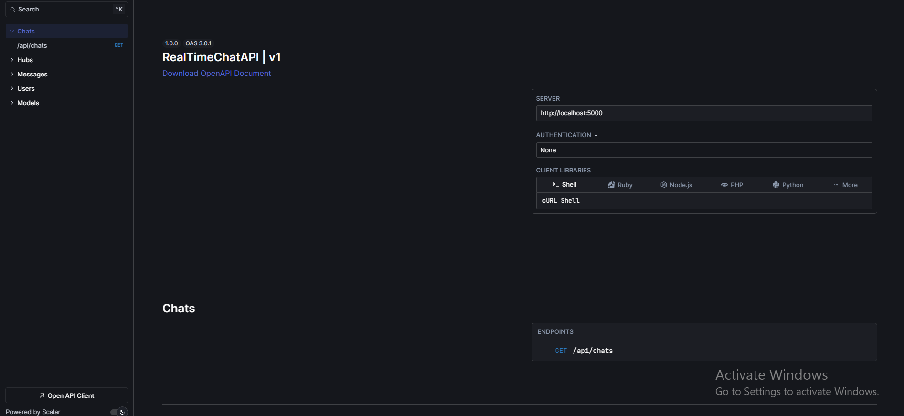
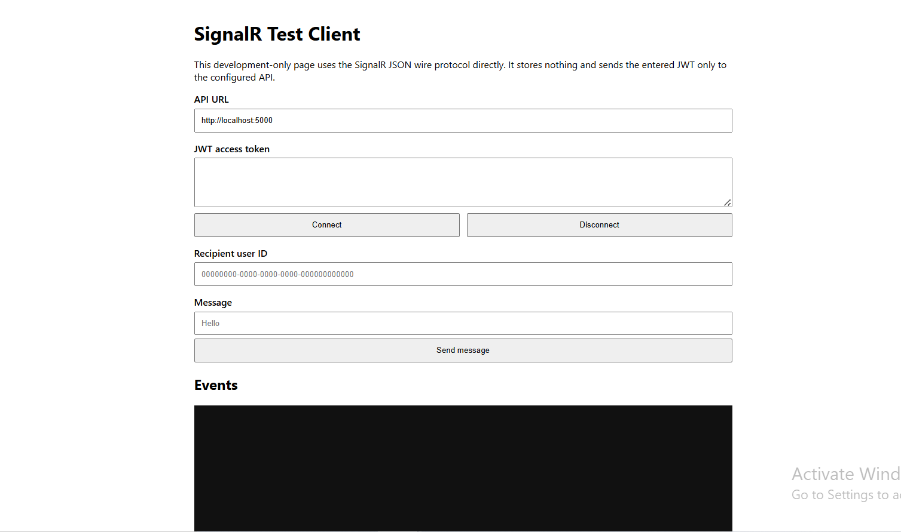

<h1 align="center">💬 Real-Time Private Chat API</h1>

<p align="center">
  <b>A secure one-to-one real-time messaging backend built with ASP.NET Core 9, SignalR, Entity Framework Core, SQL Server, JWT authentication, MediatR/CQRS, FluentValidation, AutoMapper, BCrypt, Scalar/OpenAPI, and xUnit.</b>
</p>

<p align="center">
  
  
  
  
  
  
  
  
</p>

---

## 📸 Project Screenshots

| Scalar API Documentation | SignalR Real-Time Messaging Test |
|---|---|
|  |  |

---

## 🚀 Project Overview

**Real-Time Private Chat API** is an API-first backend for authenticated one-to-one messaging. It supports account registration and login, JWT-protected user operations, persistent private messages, real-time SignalR delivery, delivery/read tracking, chat-history retrieval, chat-list retrieval, and secure profile-image management.

Messages are saved in SQL Server before delivery. A recipient who is online receives the message through SignalR immediately. A recipient who is offline receives delivery-state processing after reconnecting, while the original message remains persisted in the database.

The application uses a CQRS-style MediatR structure. Controllers send commands and queries to handlers, FluentValidation validates incoming models, AutoMapper maps entities to DTOs, BCrypt hashes passwords, Entity Framework Core manages persistence, and centralized middleware returns safe `application/problem+json` errors.

---

## 🎯 Project Purpose

This project demonstrates practical ASP.NET Core backend engineering with authentication, authorization, real-time communication, relational persistence, validation, safe file handling, error management, automated testing, and secret-safe local configuration.

It showcases:

- ASP.NET Core 9 Web API development
- Authenticated SignalR hub communication
- Private one-to-one message delivery
- Offline message persistence
- Delivered and read timestamps
- JWT Bearer authentication
- BCrypt password hashing
- MediatR-based commands and queries
- FluentValidation request validation
- Entity Framework Core with SQL Server
- Database-enforced unique usernames
- Secure profile-image validation and storage
- Thread-safe multiple-tab and multiple-device tracking
- Safe centralized HTTP exception mapping
- Scalar/OpenAPI documentation
- Repository-local Entity Framework CLI tooling
- xUnit automated tests and coverage collection
- Secret-safe local setup through .NET User Secrets

---

## ⭐ Key Highlights

- 💬 Private one-to-one chat through an authenticated SignalR hub
- 💾 Database-first persistence before real-time delivery
- 📴 Offline messages retained and marked delivered after reconnect
- ✅ Delivered and read timestamp workflows
- 🔐 JWT validation for issuer, audience, signature, expiry, and required claims
- 🔑 Password hashing with BCrypt.Net-Next
- 👤 Authenticated user ID derived from JWT claims rather than client-supplied sender IDs
- 🧵 Thread-safe tracking of multiple connections for the same account
- 🗂️ Participant-scoped chat history and chat-list queries
- 🔤 Canonical lowercase usernames with a 20-character SQL Server limit
- 🛡️ Unique username enforcement through a database index
- 🖼️ Secure profile-image extension, MIME type, size, and magic-byte validation
- 🧹 Safe image replacement and failure cleanup
- ⚠️ Generic client-facing SignalR errors with internal server logging
- 📄 Centralized RFC-style Problem Details responses
- 🗃️ Three verified Entity Framework Core migrations
- 🧪 37 passing xUnit tests
- 📘 Scalar/OpenAPI documentation in Development
- 🧰 Included Postman collection and SignalR browser test utility
- 🔒 Database and JWT secrets stored outside the repository

---

## ✨ Features

### 🔐 Authentication & Account Security

| Feature | Description |
|---|---|
| Registration | Creates a user with a normalized lowercase username |
| Password Hashing | Stores BCrypt password hashes instead of plaintext passwords |
| Login | Verifies credentials and returns a signed JWT access token |
| JWT Validation | Validates issuer, audience, HMAC-SHA256 signature, expiry, and required expiration |
| Zero Clock Skew | Expired tokens are rejected without an additional grace period |
| Authenticated Context | Reads the current user ID, username, and name from validated JWT claims |
| SignalR Authentication | Accepts query-string access tokens only for the `/ChatHub` path |
| Password Update | Allows the authenticated user to update their password |

### 👤 User Profiles

| Feature | Description |
|---|---|
| Current User | Returns the authenticated user's profile |
| User by ID | Retrieves a registered user by GUID |
| User by Username | Retrieves a registered user by normalized username |
| Profile Update | Updates the current user's name, username, and about text |
| Unique Username | Enforces canonical unique usernames in application logic and SQL Server |
| Profile Image Upload | Stores a validated image under a server-generated filename |
| Image Replacement | Removes the previous image after a successful replacement |
| Image Deletion | Deletes the authenticated user's current profile image safely |

### 💬 Real-Time Messaging

| Feature | Description |
|---|---|
| Authenticated Hub | Requires a valid JWT before establishing a SignalR connection |
| Send Message | Saves a private message and delivers it to recipient connections |
| Receive Message | Pushes a saved message to every active recipient connection |
| Sender Confirmation | Returns the saved message to the calling client through `SendMessage` |
| Offline Persistence | Retains messages in SQL Server while the recipient is disconnected |
| Delivery Status | Marks a message as delivered only for its authenticated recipient |
| Read Status | Marks eligible messages as read for the authenticated recipient |
| Bulk Read | Marks unread messages in a selected direct chat as read |
| Message Length | Rejects empty messages and messages longer than 4,000 characters |
| Multiple Connections | Delivers events to all tracked tabs/devices for one authenticated user |

### 🗂️ Chats & History

| Feature | Description |
|---|---|
| Message History | Returns messages only between the current user and the selected user |
| Chat List | Returns the authenticated user's direct-chat summaries |
| Participant Authorization | Prevents a user from retrieving a conversation between two other users |
| Ordered Messages | Returns direct-chat messages in chronological order |
| User Details | Includes mapped user details needed by chat clients |

### 🛡️ Reliability & Safe Handling

| Area | Implementation |
|---|---|
| Error Handling | Global middleware maps known failures to safe Problem Details responses |
| Unexpected Errors | Returns generic messages and logs internal details server-side |
| Image Size | Limits profile images to 5 MB |
| Image Validation | Checks extension, MIME type, and image-file magic bytes |
| Path Safety | Uses server-generated names and restricts files to `wwwroot/images` |
| Static Files | Adds `X-Content-Type-Options: nosniff` to static responses |
| Database Migration | Applies pending migrations during startup |
| CORS | Allows configured origins and credentials for the browser test client |

---

## 🛠 Technology Stack

| Layer | Technologies |
|---|---|
| Runtime | .NET 9 |
| Backend | ASP.NET Core 9 Web API, C# |
| Real-Time Transport | ASP.NET Core SignalR |
| Authentication | JWT Bearer Authentication |
| Password Security | BCrypt.Net-Next 4.0.3 |
| Application Pattern | MediatR 12.4.1, CQRS-style commands and queries |
| Validation | FluentValidation.AspNetCore 11.3.0 |
| ORM | Entity Framework Core 9.0.18 |
| Database | Microsoft SQL Server |
| Mapping | AutoMapper 13.0.1 |
| API Documentation | Scalar.AspNetCore 1.2.51, ASP.NET Core OpenAPI |
| Logging | ASP.NET Core logging, Serilog 4.2.0 package |
| Testing | xUnit 2.9.2, Microsoft.NET.Test.Sdk 17.12.0 |
| Coverage | coverlet.collector 6.0.2 |
| EF CLI | Repository-local `dotnet-ef` 9.0.18 tool manifest |
| Test Clients | Postman collection, standalone SignalR HTML client |

---

## 🏗 Architecture Overview

The application separates HTTP concerns, application commands/queries, real-time communication, persistence, and supporting security helpers.

```text
HTTP Client / Scalar / Postman
              ↓
ASP.NET Core Controllers
              ↓
MediatR Commands and Queries
              ↓
Handlers + FluentValidation
              ↓
Repositories + AutoMapper
              ↓
Entity Framework Core
              ↓
SQL Server Database
```

Real-time message flow:

```text
Authenticated SignalR client
              ↓
JWT validation and user-ID resolution
              ↓
ChatHub.SendMessage
              ↓
Recipient validation + message persistence
              ↓
Sender receives SendMessage event
              ↓
Online recipient connections receive ReceiveMessage
              ↓
Recipient delivery/read actions update SQL Server
              ↓
Sender connections receive MessageStatus
```

Offline-delivery flow:

```text
Recipient is disconnected
              ↓
Sender submits a message
              ↓
Message remains persisted with DeliveredAt = null
              ↓
Recipient reconnects with a valid JWT
              ↓
Server marks undelivered messages as delivered
              ↓
Sender connections receive MessageStatus updates
```

### Layer Responsibilities

| Layer | Responsibility |
|---|---|
| `Controllers` | HTTP routing, authorization attributes, request/response handling |
| `Services/Users/Commands` | Registration, login, profile, image, and password write operations |
| `Services/Users/Queries` | Current-user and user-lookup read operations |
| `Services/Messages/Queries` | Direct-message history and chat-list retrieval |
| `Hubs` | SignalR connections, message delivery, delivery/read state, safe hub errors |
| `Data/Repositories` | User and message database access |
| `Data/Migrations` | Versioned SQL Server schema changes |
| `Data/Seeders` | Startup application of pending EF Core migrations |
| `DTOs` | Response contracts exposed to API and SignalR clients |
| `Helpers` | JWT creation, token resolution, mapping, image validation and storage |
| `Middlewares` | Centralized HTTP exception-to-Problem-Details mapping |
| `RealTimeChatAPI.Tests` | Security, authorization, validation, image, persistence, and connection tests |

---

## 📁 Repository Structure

```text
aspnet-realtime-chat-signalr-api/
├── docs/
│   └── screenshots/
│       ├── scalar.png
│       └── signalr.png
├── RealTimeChatAPI/
│   ├── .config/
│   │   └── dotnet-tools.json
│   ├── Controllers/
│   ├── Data/
│   │   ├── Migrations/
│   │   ├── Repositories/
│   │   └── Seeders/
│   ├── docs/
│   │   ├── RealTimeChatAPI.postman_collection.json
│   │   └── signalr-test.html
│   ├── DTOs/
│   ├── Exceptions/
│   ├── Extensions/
│   ├── Helpers/
│   ├── Hubs/
│   ├── Middlewares/
│   ├── Models/
│   ├── Properties/
│   ├── RealTimeChatAPI.Tests/
│   ├── Services/
│   │   ├── Messages/
│   │   └── Users/
│   ├── wwwroot/
│   │   └── images/
│   │       └── .gitkeep
│   ├── appsettings.json
│   ├── appsettings.Development.json
│   ├── appsettings.Example.json
│   ├── Program.cs
│   ├── RealTimeChatAPI.csproj
│   └── RealTimeChatAPI.sln
├── .gitattributes
├── .gitignore
├── LICENSE
└── README.md
```

> Generated `bin`, `obj`, test-result, coverage, publish, local database, runtime image, log, `.env`, backup, and user-specific IDE files must remain untracked.

---

## 🗃 Database Model

A verified local migration creates three SQL Server tables.

| Table | Purpose |
|---|---|
| `Users` | Stores user IDs, display names, unique usernames, BCrypt hashes, profile data, and creation timestamps |
| `Messages` | Stores private-message content, sender/recipient IDs, creation time, delivery time, and read time |
| `__EFMigrationsHistory` | Tracks applied Entity Framework Core migrations |

### Relationships

```text
Users 1 ──────── * Messages (SenderId)
Users 1 ──────── * Messages (RecipientId)
```

Both message relationships use restricted delete behavior to prevent accidental cascade deletion of chat history.

### Applied Migrations

```text
20241207081444_InitialMigration
20241220090838_AddMessageEntity
20260716010000_EnforceUniqueUsername
```

The username-integrity migration:

1. Stops when normalized duplicate usernames already exist.
2. Stops when an existing username exceeds 20 characters.
3. Normalizes stored usernames to lowercase.
4. Changes `Users.Username` to `nvarchar(20)`.
5. Creates the unique index `IX_Users_Username`.

---

## 🔄 Application Flows

### Registration

```text
Client submits name, username, and password
              ↓
FluentValidation validates the command
              ↓
Username is normalized with ToLowerInvariant()
              ↓
Application checks existing usernames
              ↓
BCrypt hashes the password
              ↓
Entity Framework Core stores the user
              ↓
SQL Server unique index protects against race-condition duplicates
```

### Login

```text
Client submits username and password
              ↓
Username is normalized
              ↓
User is loaded from SQL Server
              ↓
BCrypt verifies the password hash
              ↓
JWT is issued with subject ID, username, and display-name claims
              ↓
Client uses Authorization: Bearer TOKEN for protected HTTP requests
```

### SignalR Connection

```text
Client negotiates with a valid JWT
              ↓
JwtBearer middleware validates the token
              ↓
AuthenticatedUserIdProvider reads the sub claim
              ↓
Connection ID is registered for the authenticated user
              ↓
Persisted undelivered messages are marked delivered
              ↓
Connection remains available for real-time events
```

### Send and Receive Message

```text
Sender invokes SendMessage(recipientId, content)
              ↓
Hub validates recipient ID and message length
              ↓
Recipient account is verified
              ↓
Sender ID comes from the authenticated connection
              ↓
Message is saved to SQL Server
              ↓
Sender receives the saved SendMessage event
              ↓
All active recipient connections receive ReceiveMessage
```

### Profile Image Update

```text
Authenticated user submits multipart image
              ↓
Validator checks size, extension, MIME type, and magic bytes
              ↓
Server generates a random safe filename
              ↓
File is written only inside wwwroot/images
              ↓
Database profile path is updated
              ↓
Previous image is removed after successful replacement
              ↓
New file is cleaned up if persistence fails
```

---

## 🔌 API Endpoints

Base API routes:

```text
/api/users
/api/messages
/api/chats
/api/hubs
```

SignalR hub:

```text
/ChatHub
```

### Users

| Method | Endpoint | Authentication | Purpose |
|---|---|---|---|
| `POST` | `/api/users/register` | Public | Register a new user |
| `POST` | `/api/users/login` | Public | Log in and receive a JWT |
| `GET` | `/api/users/me` | Bearer token | Return the current user's profile |
| `PATCH` | `/api/users/me` | Bearer token | Update current-user profile data |
| `PATCH` | `/api/users/me/image` | Bearer token | Upload or replace the current profile image |
| `DELETE` | `/api/users/me/image` | Bearer token | Delete the current profile image |
| `PATCH` | `/api/users/me/password` | Bearer token | Update the current user's password |
| `GET` | `/api/users/{id:guid}` | Bearer token | Find a registered user by GUID |
| `GET` | `/api/users/{username}` | Bearer token | Find a registered user by username |

### Messages & Chats

| Method | Endpoint | Authentication | Purpose |
|---|---|---|---|
| `GET` | `/api/messages/{userId}` | Bearer token | Return direct-message history with the selected user |
| `GET` | `/api/chats` | Bearer token | Return the authenticated user's chat summaries |

### Hub Metadata

| Method | Endpoint | Authentication | Purpose |
|---|---|---|---|
| `GET` | `/api/hubs/ChatHub/info` | Public | Describe available hub methods and client events |

### SignalR Hub Methods

| Method | Arguments | Purpose |
|---|---|---|
| `SendMessage` | `string userId, string message` | Save and send a private message |
| `DeliveredMessage` | `string messageId` | Mark one received message as delivered |
| `DeliveredAndReadMessage` | `string messageId` | Mark one received message as delivered and read |
| `ReadMessages` | `string userChatId` | Mark unread messages in a direct chat as read |

### SignalR Client Events

| Event | Purpose |
|---|---|
| `SendMessage` | Returns the saved message to the sending connection |
| `ReceiveMessage` | Sends a new message to recipient connections |
| `MessageStatus` | Sends delivery/read status changes to sender connections |
| `Error` | Returns a safe client-facing hub error |

### Documentation

| Method | Endpoint | Availability | Purpose |
|---|---|---|---|
| `GET` | `/scalar/v1` | Development | Open Scalar interactive API documentation |
| `GET` | `/openapi/v1.json` | Development | Return the generated OpenAPI document |

### Common HTTP Responses

| Status | Meaning |
|---|---|
| `200 OK` | Request completed successfully |
| `204 No Content` | Profile, password, or image mutation completed |
| `400 Bad Request` | Validation or malformed input failed |
| `401 Unauthorized` | Authentication is missing, invalid, or expired |
| `403 Forbidden` | The authenticated user cannot perform the action |
| `404 Not Found` | Requested user or message does not exist |
| `409 Conflict` | Username or concurrency conflict occurred |
| `500 Internal Server Error` | An unexpected server failure occurred |

---

## 🔐 Security & Reliability

| Area | Implementation |
|---|---|
| Passwords | BCrypt hashes are stored instead of plaintext passwords |
| JWT Signing | HMAC-SHA256 with a secret of at least 32 bytes |
| JWT Validation | Issuer, audience, signature, lifetime, algorithm, and expiration are validated |
| Sender Identity | Sender ID is derived from the authenticated SignalR principal |
| Query Token Scope | Query-string JWT extraction is restricted to `/ChatHub` |
| Usernames | Lowercase normalization, 20-character limit, and a unique SQL Server index |
| Chat Authorization | Message history always includes the authenticated user as a participant |
| Status Authorization | Only the message recipient can mark delivery/read state |
| Message Validation | Empty and over-4,000-character messages are rejected |
| Image Uploads | Size, extension, MIME type, magic bytes, path, and filename are validated |
| Static Files | `X-Content-Type-Options: nosniff` is added |
| Errors | Known failures map to safe Problem Details; unexpected details stay server-side |
| CORS | Origins are read from configuration and credentials are explicitly enabled |
| Secrets | Connection string and JWT secret remain outside Git |
| Tests | 37 tests verify security, authorization, persistence, validation, and cleanup behavior |

> This is a portfolio-grade single-instance backend. Production deployment requires reviewed dependency updates, centralized secret management, distributed SignalR infrastructure, shared/object image storage, rate limiting, monitoring, audit logging, backups, and an operational security review.

---

## ⚙️ Installation Guide — Windows PowerShell

### Requirements

- Windows 10 or Windows 11
- PowerShell 5.1 or PowerShell 7+
- .NET 9 SDK
- Microsoft SQL Server, SQL Server Developer Edition, SQL Server Express, or LocalDB
- Git
- Node.js only for the included SignalR browser test client
- Optional: GitHub CLI for creating and pushing the repository from PowerShell

Verify the installed tools:

```powershell
dotnet --version
dotnet --list-sdks
git --version
node --version
npm.cmd --version
```

Confirm that the .NET SDK list includes `9.x.x`.

### 1️⃣ Clone and Open the Repository

```powershell
git clone https://github.com/YOUR_GITHUB_USERNAME/aspnet-realtime-chat-signalr-api.git
Set-Location '.\aspnet-realtime-chat-signalr-api'

$RepoRoot = (Get-Location).Path
$SolutionRoot = Join-Path $RepoRoot 'RealTimeChatAPI'
$SolutionFile = Join-Path $SolutionRoot 'RealTimeChatAPI.sln'
$ProjectFile = Join-Path $SolutionRoot 'RealTimeChatAPI.csproj'
$TestProject = Join-Path $SolutionRoot 'RealTimeChatAPI.Tests\RealTimeChatAPI.Tests.csproj'
```

### 2️⃣ Verify SQL Server

For the default SQL Server instance:

```powershell
$SqlServer = $env:COMPUTERNAME
Get-Service -Name 'MSSQLSERVER'
```

For SQL Server Express:

```powershell
$SqlServer = "$env:COMPUTERNAME\SQLEXPRESS"
```

For LocalDB:

```powershell
$SqlServer = '(localdb)\MSSQLLocalDB'
sqllocaldb start MSSQLLocalDB
```

Create the local connection string:

```powershell
$DatabaseName = 'RealTimeChatDb'
$ConnectionString = "Server=$SqlServer;Database=$DatabaseName;Trusted_Connection=True;MultipleActiveResultSets=True;TrustServerCertificate=True"
```

### 3️⃣ Restore Tools and Packages

```powershell
Set-Location -LiteralPath $SolutionRoot

dotnet restore $SolutionFile
dotnet tool restore
dotnet ef --version
```

### 4️⃣ Configure Local User Secrets

Set the development environment:

```powershell
$env:ASPNETCORE_ENVIRONMENT = 'Development'
$env:DOTNET_ENVIRONMENT = 'Development'
```

Generate a cryptographically random JWT key:

```powershell
$JwtBytes = New-Object byte[] 64
$Generator = [Security.Cryptography.RandomNumberGenerator]::Create()

try {
    $Generator.GetBytes($JwtBytes)
    $JwtSecret = [Convert]::ToBase64String($JwtBytes)
}
finally {
    $Generator.Dispose()
}
```

Store database and JWT settings:

```powershell
dotnet user-secrets set `
    'ConnectionStrings:RealTimeChatDb' `
    $ConnectionString `
    --project $ProjectFile

dotnet user-secrets set 'Jwt:Secret' $JwtSecret --project $ProjectFile
dotnet user-secrets set 'Jwt:Issuer' 'RealTimeChatAPI' --project $ProjectFile
dotnet user-secrets set 'Jwt:Audience' 'RealTimeChatAPI.Clients' --project $ProjectFile
dotnet user-secrets set 'Jwt:ExpirationInMinutes' '180' --project $ProjectFile

Remove-Variable JwtSecret, JwtBytes, Generator -ErrorAction SilentlyContinue
```

Review configured keys:

```powershell
dotnet user-secrets list --project $ProjectFile |
    ForEach-Object { ($_ -split ' = ', 2)[0] }
```

Do not commit a JWT secret, database password, connection string, access token, populated `.env`, or User Secrets store.

### 5️⃣ Build the Solution

```powershell
Set-Location -LiteralPath $SolutionRoot

dotnet clean $SolutionFile --configuration Debug
dotnet build $SolutionFile --configuration Debug --no-restore
```

Expected result:

```text
Build succeeded.
```

### 6️⃣ Run the Automated Tests

```powershell
dotnet test `
    $SolutionFile `
    --configuration Debug `
    --no-restore `
    --no-build
```

Verified result:

```text
Test summary: total: 37, failed: 0, succeeded: 37, skipped: 0
```

### 7️⃣ Apply Entity Framework Core Migrations

```powershell
dotnet ef database update `
    --project $ProjectFile `
    --startup-project $ProjectFile `
    --configuration Debug
```

Verify migration status:

```powershell
dotnet ef migrations list `
    --project $ProjectFile `
    --startup-project $ProjectFile
```

Applied migrations are displayed without `(Pending)`.

> Do not create a new initial migration. The repository already includes its complete migration history.

### 8️⃣ Run the Backend API

```powershell
$env:ASPNETCORE_ENVIRONMENT = 'Development'
$env:DOTNET_ENVIRONMENT = 'Development'

Set-Location -LiteralPath $SolutionRoot

dotnet run `
    --project $ProjectFile `
    --configuration Debug `
    --launch-profile http `
    --no-build
```

Local URLs:

```text
HTTP API:  http://localhost:5000
Scalar:    http://localhost:5000/scalar/v1
OpenAPI:   http://localhost:5000/openapi/v1.json
SignalR:   http://localhost:5000/ChatHub
```

Keep the PowerShell window open while the backend runs. Stop it with `Ctrl+C`.

Open Scalar from a second PowerShell window:

```powershell
Start-Process 'http://localhost:5000/scalar/v1'
```

### 9️⃣ Run the SignalR Test Client

The included HTML page is a development/testing utility, not a complete frontend application.

From another PowerShell window:

```powershell
$RepoRoot = 'C:\path\to\aspnet-realtime-chat-signalr-api'
$SolutionRoot = Join-Path $RepoRoot 'RealTimeChatAPI'

Set-Location -LiteralPath $SolutionRoot

npx.cmd --yes http-server `
    '.\docs' `
    -p 5173 `
    -c-1
```

Open:

```powershell
Start-Process 'http://localhost:5173/signalr-test.html'
```

Testing sequence:

1. Register two users through Scalar or PowerShell.
2. Log in both users and save their JWT tokens.
3. Open the test page in two separate browser sessions.
4. Paste User One's token and use User Two's ID as recipient.
5. Paste User Two's token and use User One's ID as recipient.
6. Connect both clients and exchange messages.
7. Disconnect one client to verify offline persistence and reconnect delivery behavior.

---

## ▶️ Normal Daily Startup

After the initial setup and migrations, start the backend:

```powershell
$RepoRoot = 'C:\path\to\aspnet-realtime-chat-signalr-api'
$SolutionRoot = Join-Path $RepoRoot 'RealTimeChatAPI'
$ProjectFile = Join-Path $SolutionRoot 'RealTimeChatAPI.csproj'

Set-Location -LiteralPath $SolutionRoot

$env:ASPNETCORE_ENVIRONMENT = 'Development'
$env:DOTNET_ENVIRONMENT = 'Development'

dotnet run `
    --project $ProjectFile `
    --configuration Debug `
    --launch-profile http `
    --no-build
```

Start the SignalR test client from a second PowerShell window:

```powershell
Set-Location -LiteralPath $SolutionRoot
npx.cmd --yes http-server '.\docs' -p 5173 -c-1
```

Open the tools:

```powershell
Start-Process 'http://localhost:5000/scalar/v1'
Start-Process 'http://localhost:5173/signalr-test.html'
```

---

## 🧪 Testing

Run the complete suite:

```powershell
Set-Location -LiteralPath $SolutionRoot

dotnet test `
    $SolutionFile `
    --configuration Debug
```

Collect coverage:

```powershell
dotnet test `
    $SolutionFile `
    --configuration Debug `
    --collect:'XPlat Code Coverage'
```

The 37 tests verify areas including:

- Registration and login command behavior
- JWT configuration and validation security
- SignalR query-token path restrictions
- Username normalization and persistence
- Unique username metadata and conflict behavior
- Current-username profile updates
- Rejection of another user's username
- Participant-scoped message history
- Message delivery/read authorization
- Offline message persistence behavior
- Multiple connection tracking
- Duplicate connection handling
- Profile-image file-size validation
- Extension, MIME, and magic-byte validation
- Safe image path generation and deletion
- Image cleanup after failed persistence
- Validation command failures
- Centralized HTTP exception status mapping
- Generic unexpected-error responses

Run one test class:

```powershell
dotnet test `
    $TestProject `
    --configuration Debug `
    --filter 'FullyQualifiedName~JwtSecurityTests'
```

Check dependency advisories before deployment:

```powershell
dotnet list $SolutionFile package --vulnerable --include-transitive
dotnet list $SolutionFile package --outdated
```

---

## 🧾 Example API Usage

### Register User One

```powershell
$ApiUrl = 'http://localhost:5000'

Invoke-RestMethod `
    -Uri "$ApiUrl/api/users/register" `
    -Method Post `
    -ContentType 'application/json' `
    -Body (@{
        name     = 'User One'
        username = 'userone'
        password = 'Password123!'
    } | ConvertTo-Json)
```

### Register User Two

```powershell
Invoke-RestMethod `
    -Uri "$ApiUrl/api/users/register" `
    -Method Post `
    -ContentType 'application/json' `
    -Body (@{
        name     = 'User Two'
        username = 'usertwo'
        password = 'Password123!'
    } | ConvertTo-Json)
```

### Log In and Capture a JWT

```powershell
$LoginResponse = Invoke-RestMethod `
    -Uri "$ApiUrl/api/users/login" `
    -Method Post `
    -ContentType 'application/json' `
    -Body (@{
        username = 'userone'
        password = 'Password123!'
    } | ConvertTo-Json)

$Token = $LoginResponse.token
```

### Get the Current User

```powershell
$CurrentUser = Invoke-RestMethod `
    -Uri "$ApiUrl/api/users/me" `
    -Method Get `
    -Headers @{ Authorization = "Bearer $Token" }

$CurrentUser
```

### Get Message History

```powershell
$OtherUserId = 'REPLACE_WITH_OTHER_USER_GUID'

Invoke-RestMethod `
    -Uri "$ApiUrl/api/messages/$OtherUserId" `
    -Method Get `
    -Headers @{ Authorization = "Bearer $Token" }
```

### Inspect Hub Metadata

```powershell
Invoke-RestMethod `
    -Uri "$ApiUrl/api/hubs/ChatHub/info" `
    -Method Get |
    ConvertTo-Json -Depth 10
```

---

## ⚙️ Configuration Reference

| Key | Purpose |
|---|---|
| `ConnectionStrings:RealTimeChatDb` | SQL Server connection string |
| `Jwt:Secret` | JWT HMAC signing secret of at least 32 bytes |
| `Jwt:Issuer` | Expected JWT issuer |
| `Jwt:Audience` | Expected JWT audience |
| `Jwt:ExpirationInMinutes` | Access-token lifetime |
| `Origins:0`, `Origins:1`, ... | Allowed credentialed CORS origins |

Environment-variable equivalents use double underscores:

```text
ConnectionStrings__RealTimeChatDb
Jwt__Secret
Jwt__Issuer
Jwt__Audience
Jwt__ExpirationInMinutes
Origins__0
```

Example configuration shape without secrets:

```json
{
  "ConnectionStrings": {
    "RealTimeChatDb": ""
  },
  "Jwt": {
    "Secret": "",
    "ExpirationInMinutes": 180,
    "Issuer": "RealTimeChatAPI",
    "Audience": "RealTimeChatAPI.Clients"
  },
  "Origins": [
    "http://localhost:5173"
  ]
}
```

---

## 📦 Production Publish

Create a release build:

```powershell
Set-Location -LiteralPath $SolutionRoot

dotnet publish `
    $ProjectFile `
    --configuration Release `
    --output '.\publish'
```

---

## 👨‍💻 Author

**Muhammad Ali Nawaz**  
ASP.NET Core Developer

---

## 📄 License

This project is open-source software licensed under the [MIT License](LICENSE).

---

<p align="center">
  <b>⭐ If this project helps you, consider starring the repository!</b>
</p>
